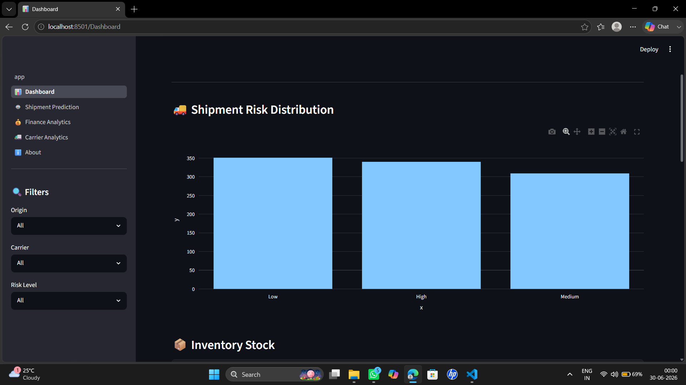
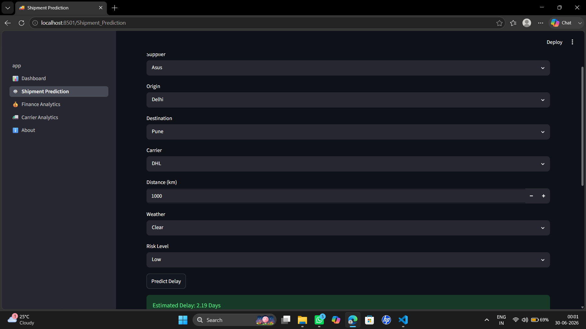
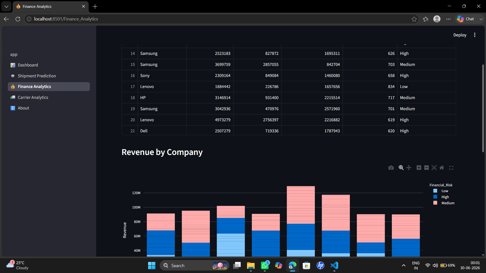
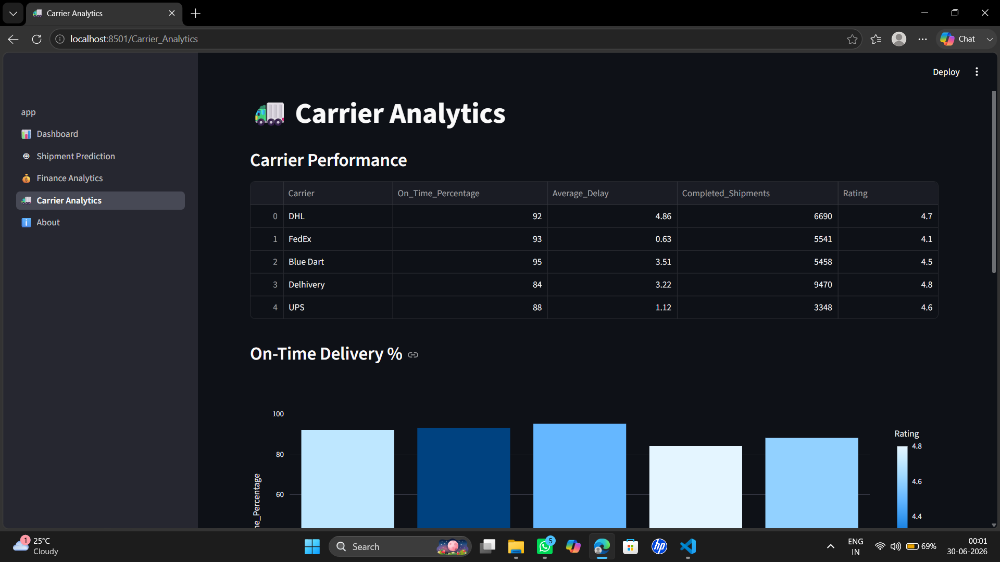

# 🚚 LogisChain AI

An AI-powered logistics management dashboard built with **Python**, **Streamlit**, **Pandas**, **Plotly**, and **Scikit-learn**.

## 📌 Features

- 📊 Interactive Dashboard
- 🤖 AI Shipment Delay Prediction
- 💰 Financial Analytics
- 🚛 Carrier Performance Analytics
- 🔍 Interactive Filters
- 📈 Plotly Charts
- 🥧 Financial Risk Pie Chart
- 📥 Download Filtered Data as CSV

## 🛠️ Technologies Used

- Python
- Streamlit
- Pandas
- NumPy
- Plotly
- Scikit-learn

## 🚀 Installation

```bash
git clone <your-github-repository-url>
cd LogisChain_AI
pip install -r requirements.txt
streamlit run app.py
```

## 📸 Screenshots

## 📸 Dashboard



---

## 🚚 Shipment Prediction



---

## 💰 Finance Analytics



---

## 🚛 Carrier Analytics



## 👨‍💻 Author

Meet Gupta